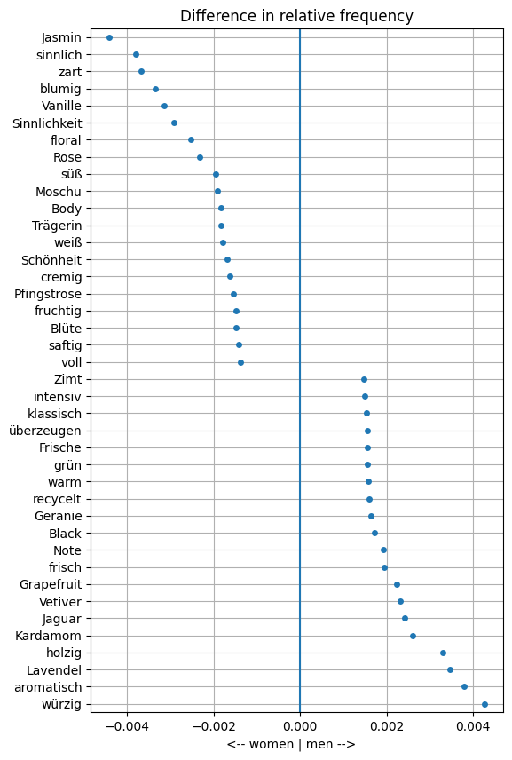
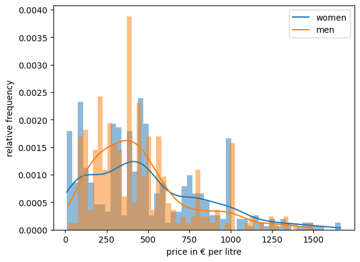
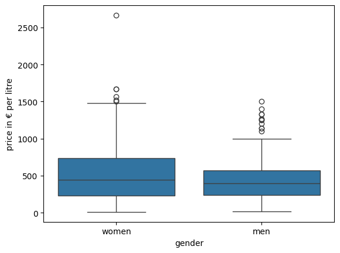
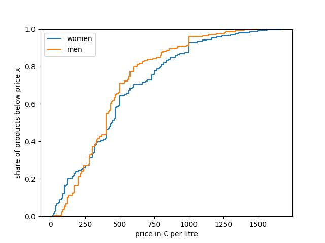
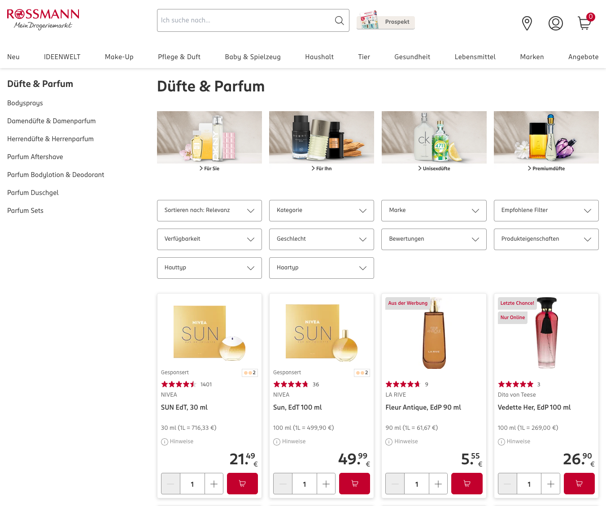
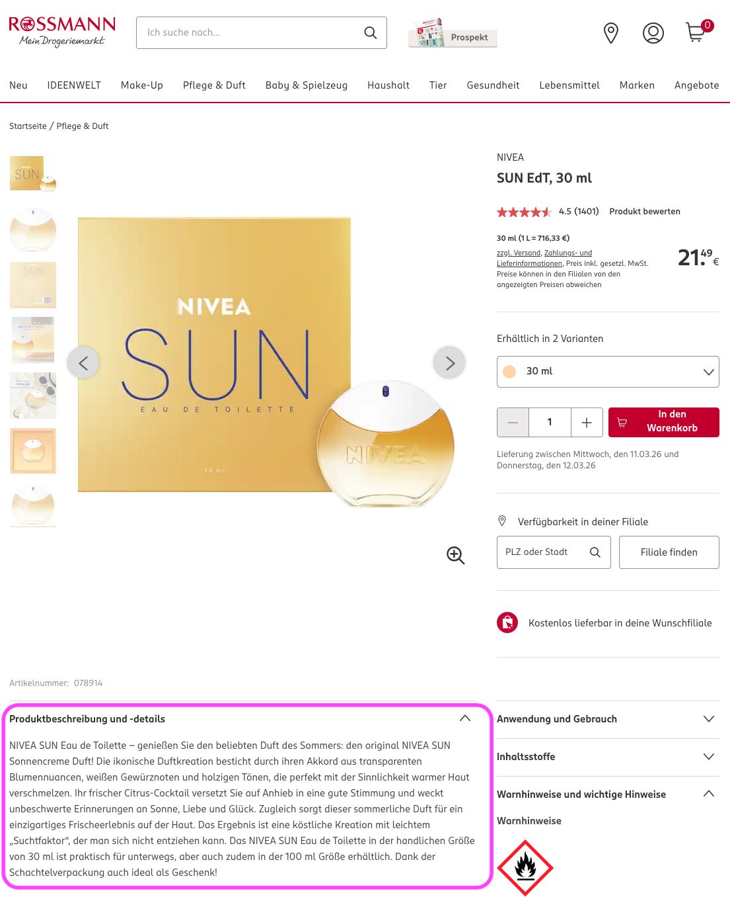

# Gender-based variations in perfume descriptions

### About

This repo explores how the description of perfumes differs by gender, i.e. how women's and men's fragrances use different wordings. It is a Python/Jupyter-based data science project focusing on web scraping, lemmatization and visualization. 

### Key findings
####  Perfume descriptions by gender
Women's and men's fragrances are described and advertised in different ways. Specifically, the wordings differs in that certain words are overrepresented for one gender and underrepresented in the other, respectively. The following graph shows the most overrepresented words for women's fragrances at the top and the ones for men's at the bottom.

We find that women's perfumes tend to be advertised using vocabulary such as "sinnlich" (*sensual*) and "zart" (*tender*), while men's fragrances are described as "würzig" (*spicy*) or "aromatisch" (*aromatic*).



For this analysis, we have lemmatized words (to account for inflections), created document term matrices for each gender and compared the relative frequencies. Stop words, gender indicators ("Mann", "Frau", etc.) and brand names were excluded. The visualization then shows the words that have the highest difference in frequency between the genders.

#### Perfume pricing by gender
The analysis also compares the prices of women's and men's fragrances. We find slightly higher and more dispersed prices for women, but not to a statistically significant extent, as visualized below.

|  |  |  |
|:-------------------------:|:-------------------------:|:-------------------------:|
| frequency distribution          | boxplots     | cumulative density functions         |

### Methodology

- **Data:** perfume information is taken from the website of a german drugstore chain, Rossmann. Its perfumes and fragrances can be found [here](https://www.rossmann.de/de/pflege-und-duft/duefte-und-parfum/c/olcat2_5).
- **Tools:** the project combines web scraping (to acquire the perfume data), numerical and textual data analysis (to compare prices and descriptions) as well as visualizations
- **Procedure:** 
    1. scrape product listings pages showing a condensed view of items

    
    
    2. scrape product details pages showing specific information in individual items (see text in purple box in the screenshot below)

    

    3. analyze numerical data: compare prices between women's vs. men's perfumes (see plots above)
    4. analyze textual data: lemmatize text descriptions -> create document term matrices -> compare term frequencies -> visualize (see plots above)

### Usage

The analysis can be reproduced by running the Jupyter notebook:

```
pyenv local 3.12.12
python -m venv .venv
source .venv/bin/activate
pip install --upgrade pip
pip install -r requirements.txt
```

Note that the webshop that is being scraped may be modified, requiring a revision of the scraping. However, the scraped data is available in the file `full_data.csv`.