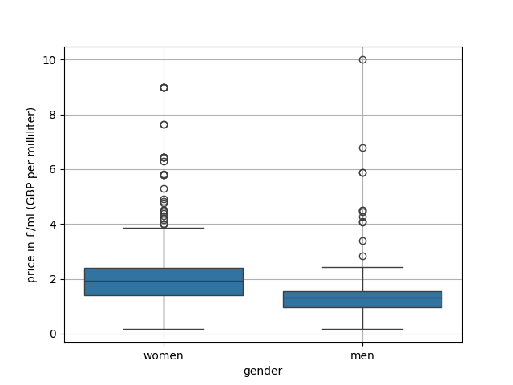
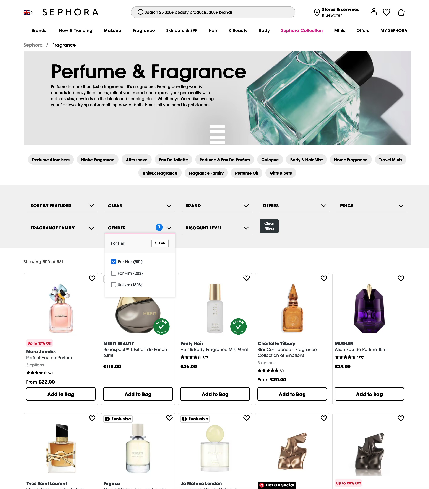
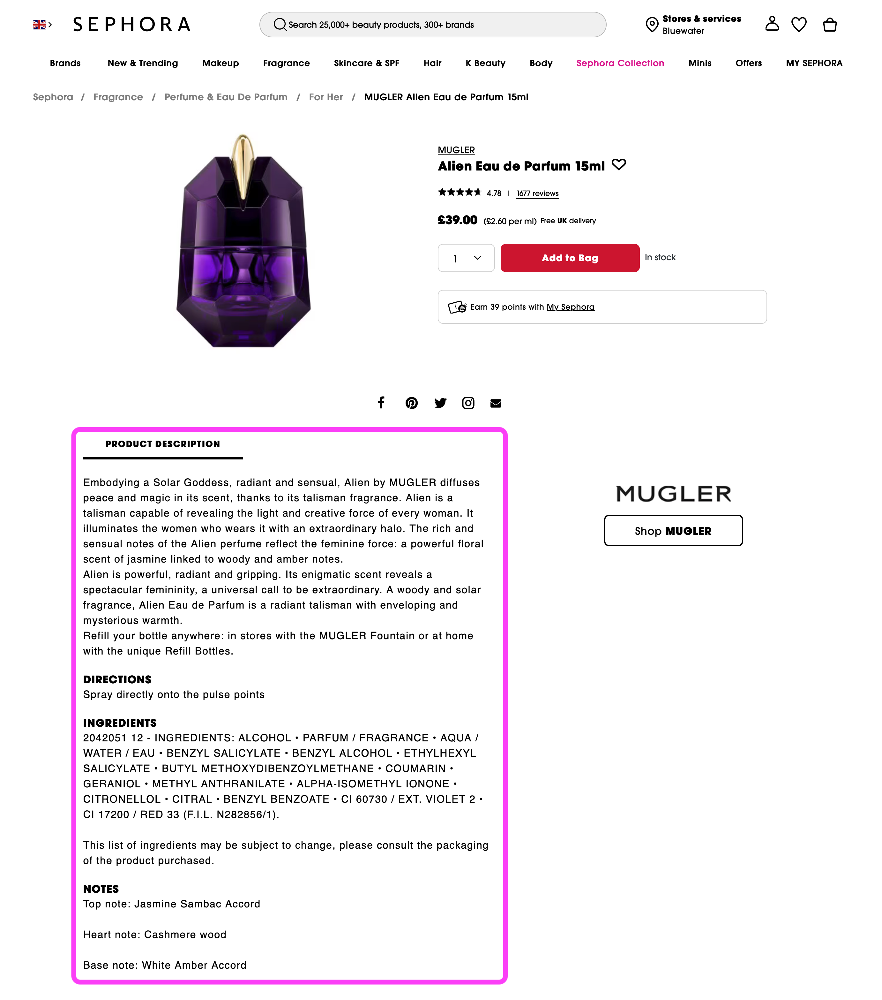

# Gender-based variations in perfume descriptions

### About

This repo explores how the description of perfumes differs by gender, i.e. how women's and men's fragrances use different wordings. It is a Python/Jupyter-based data science project focusing on web scraping, lemmatization and visualization. 

### Main findings
####  Perfume descriptions by gender
Women's and men's fragrances are described and advertised in different ways. Specifically, the wordings differs in that certain words are overrepresented for one gender and underrepresented in the other, respectively. The following graph shows the most overrepresented words for women's fragrances at the top and the ones for men's at the bottom.

> **KEY:** We find that women's perfumes focuses on "flowery" vocabulary (such as _flower_, _floral_, _bloom_, _rose_) and a specific colour palette (pink, white). Men's fragrances, on the other hand, are advertised with a different colour focus (black, blue) and different, allegedly more masculine attributes (such as _intense_ and _boss_[^1]).<br>
These findings can either be interpreted as "unsurprising" or as yet another enforecement of gender stereotypes in everyday marketing.


For this analysis, we have lemmatized words (to account for inflections), created document term matrices for each gender and compared the relative frequencies. Stop words, gender indicators ("man", "woman", etc.) and brand names were excluded. The visualization then shows the words that have the highest difference in frequency between the genders.

#### Perfume pricing by gender
The analysis also compares the prices of women's and men's fragrances. We find that prices for women are slightly higher on average and more dispersed prices than prices for men, but not to a statistically significant extent. Price distributions are visualised below (click for larger versions).

|  |  |  |
|:-------------------------:|:-------------------------:|:-------------------------:|
| frequency distribution          | boxplots     | cumulative density functions         |

#### German data
The original analysis focused on text data in English from an international retailer. In addition, we conducted a similar analysis for German data. To ensure that the localised descriptions are not merely translations of English ones, we focused on a national (instead of an international) drug store chain (see the methodology section for the dataset). 

We find that women's perfumes tend to be advertised using vocabulary such as "sinnlich" (sensual) and "zart" (tender), while men's fragrances are described as "würzig" (spicy) or "aromatisch" (aromatic). The numerical findings mirror the ones for the English data. 

Since the German webshop requires a different scraping method, we included a separate notebook for the German data. All plots and dataset for the English version (above) are also available for the German one.

### Methodology

- **Data:** perfume information is taken from the website of a major retailer for beauty and healthcare products. Its perfumes and fragrances can be found [here](https://www.sephora.co.uk/fragrances?#inline-facets). For the German data we scraped the fragrance section of national drug store's webshop found [here](https://www.rossmann.de/de/pflege-und-duft/duefte-und-parfum/c/olcat2_5).
- **Tools:** the project combines web scraping (to acquire the perfume data), numerical and textual data analysis (to compare prices and descriptions) as well as visualizations
- **Procedure:** 
    1. scrape product listings pages showing a condensed view of items

    
    
    2. scrape product details pages showing specific information in individual items (see text in purple box in the screenshot below)

    

    3. analyze numerical data: compare prices between women's vs. men's perfumes (see plots above)
    4. analyze textual data: lemmatize text descriptions -> create document term matrices -> compare term frequencies -> visualize (see plots above)

### Usage

The analysis can be reproduced by running the Jupyter notebook:

```
pyenv local 3.12.12
python -m venv .venv
source .venv/bin/activate
pip install --upgrade pip
pip install -r requirements.txt
```

Note that the webshop that is being scraped may be modified, requiring a revision of the scraping. However, the scraped data is available via the file [`webshop_data_scraped.csv`](data/webshop_data_scraped_EN.csv). Similarly, the document term matrices created based on the lemmatised text descriptions are found in [`document_term_matrix_EN.csv`](data/document_term_matrix_EN.csv).

--- 

[^1]: The higher frequencya of the word "boss" in the description of men's fragrances vis-à-vis women's is partially, but not fully explained by the fact that there is a higher ration of fragrances by the brand of the same name offered for men than for women.
