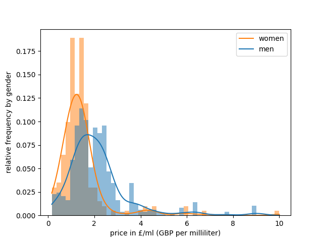
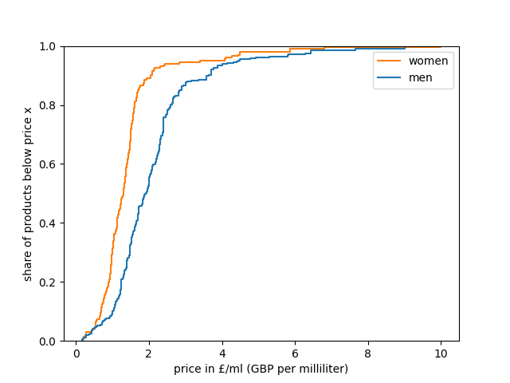

<figure style="text-align:center;">
  
  <figcaption><em>(Banner image) Image by author, created using AI</em></figcaption>
</figure>

# Boss vs. Bloom: Uncovering Gender Bias in Fragrance Descriptions with Python

*Using NLP and web scraping to analyse how fragrance retailers use different language and pricing for women's and men's products*

---

There is a long-running debate about whether products marketed to women are priced higher than equivalent products marketed to men — the so-called "pink tax." The fragrance industry, with its strict gender segmentation and wildly varying price points, offers a natural testing ground. But rather than just looking at price, this project asks a second, more subtle question: **do brands actually describe and advertise fragrances differently depending on the intended gender?**

To find out, this article walks through a complete data science pipeline: scraping product data from a major online fragrance retailer, comparing prices across genders, and applying NLP techniques to the product descriptions to identify the words that are most distinctively associated with women's versus men's fragrances.

All code is in Python and the project combines web scraping (`requests`, `BeautifulSoup`), numerical analysis (`pandas`, `seaborn`), and language analysis (`spaCy`). The full project — code, scraped data, and document-term matrices — is available at [github.com/colinvn/perfumes-by-gender](https://github.com/colinvn/perfumes-by-gender).

---

## The Data: Scraping Sephora

The data comes from the fragrance section of [Sephora UK](https://www.sephora.co.uk/fragrances). The scraping process takes place in two stages, mirroring the two-level structure of the webshop itself.

### Stage 1: Product Listings Page

The product listings page shows a condensed overview of all available items, including product names, prices, and links to individual product pages. Crucially, the URL encodes the gender filter directly, which makes it easy to collect women's and men's fragrances separately.

<figure style="text-align:center;">
  
  <figcaption><em>Website by Sephora, screenshot by author</em></figcaption>
</figure>

We construct the URL for each gender and request the page using the `requests` library. The HTML is then parsed with `BeautifulSoup` to extract the product SKU (a unique product identifier) and the URL of each product's detail page.

```python
import requests
from bs4 import BeautifulSoup
import pandas as pd
import numpy as np

headers = {'User-Agent': 'my-app/0.1'}  # without headers, access is denied

url_product_list = {}
genders = ['women', 'men']

for gender in genders:
    url_base = 'https://www.sephora.co.uk/fragrances'
    url_filter = '?filter=fhlocation=c1:en-GB:categories%3Cc1:c1:c2:hisandhers%3E'
    url_gender = '2' if gender == 'women' else '1'
    url_end = ('!brand=a70!restricted=1&fhviewsize=600&siteid=79&sitearea=department'
               '&device=desktop&special-pagedepth=home&fhref=viewlister&fhref=facet=hisandhers')
    url_product_list[gender] = url_base + url_filter + url_gender + url_end

product_listings = {}
for gender in genders:
    response = requests.get(url_product_list[gender], headers=headers)
    soup = BeautifulSoup(response.text, 'html.parser')
    product_listings[gender] = soup.find_all('div', class_='Product')
    print(f'Collected {len(product_listings[gender])} items for {gender}.')
```

This yields 500 items for women and 203 items for men. From each product card, we extract the SKU and the full URL:

```python
col_id, col_url, col_gender = [], [], []

for gender in genders:
    for product in product_listings[gender]:
        tag = product.select('a')[0]
        sku = tag['data-product-sku']   # stock-keeping unit — basically a product ID
        href = tag['href']
        col_id.append(sku)
        col_url.append('https://www.sephora.co.uk' + href)
        col_gender.append(gender)

df = pd.DataFrame({'id': col_id, 'url': col_url, 'gender': col_gender})
```

The result is a dataframe with 703 rows, each containing a product ID, a URL, and a gender label — ready to be used as a crawl list for the next stage.

### Stage 2: Product Details Page

Each product detail page contains the actual text description and the per-millilitre price — the two pieces of information we care about most. The description is a few paragraphs of marketing copy, followed by fragrance notes and an ingredient list.

<figure style="text-align:center;">
  
  <figcaption><em>Website by Sephora, screenshot by author</em></figcaption>
</figure>

We define a function that requests a single product page and extracts the description and price:

```python
def get_product_data(url):
    response = requests.get(url, headers=headers)
    soup = BeautifulSoup(response.text, 'html.parser')

    try:
        price_per_ml = float(
            soup.find('span', class_='price-per-ml info-price-per-ml')
            .text.strip()
            .split('(')[1].split('/')[0]
            .replace(',', '.')
        )
    except:
        price_per_ml = np.nan

    try:
        description = soup.find('section', id='information').text.strip().replace('\n', '. ')
    except:
        description = np.nan

    return {'price_per_ml': price_per_ml, 'description': description}
```

We then iterate over all product URLs and populate the dataframe:

```python
df['description'] = pd.NA
df['price_per_ml'] = pd.NA

gender_count = {'women': df['gender'].eq('women').sum(), 'men': df['gender'].eq('men').sum()}
total = len(df)

for i in df.index:
    url = df.at[i, 'url']
    product_data = get_product_data(url)
    df.at[i, 'description'] = product_data['description']
    df.at[i, 'price_per_ml'] = product_data['price_per_ml']
```

After converting `price_per_ml` to a numeric type and checking for missing values — there are none for either descriptions or prices — we have a clean dataset of **703 products** (491 women's, 201 men's), each with a text description and a price per millilitre. This is the dataset that drives both analyses below.

---

## Numerical Analysis: Do Women Pay More?

The most immediate question is whether women's fragrances cost more than men's. The summary statistics give a first impression:

| | Count | Mean (£/ml) | Median (£/ml) | Std. dev. |
|--|--|--|--|--|
| Women | 491 | 2.13 | 1.92 | 1.33 |
| Men | 201 | 1.45 | 1.30 | 1.10 |

Women's fragrances do appear more expensive on average — £2.13/ml versus £1.45/ml for men. But before drawing conclusions, we need to look at the full distributions.

```python
import matplotlib.pyplot as plt
import seaborn as sns

fig, ax = plt.subplots()
sns.histplot(
    ax=ax, data=df, x='price_per_ml', hue='gender',
    stat='probability', common_norm=False,
    bins=50, kde=True, edgecolor='none',
)
ax.set_xlabel('price in £/ml (GBP per milliliter)')
ax.set_ylabel('relative frequency by gender')
ax.legend(['women', 'men'])
plt.show()
```

<figure style="text-align:center;">
  
  <figcaption><em>Image by author</em></figcaption>
</figure>

The frequency distributions reveal that both distributions are right-skewed, with a long tail of high-priced premium and niche fragrances. Women's fragrances peak at a slightly higher price and have a heavier tail, but the shapes are broadly similar.

<figure style="text-align:center;">
  
  <figcaption><em>Image by author</em></figcaption>
</figure>


The box plots confirm that the interquartile range for women (roughly £1.40–£2.40/ml) is higher and wider than for men (roughly £0.95–£1.56/ml), and that women's fragrances show more outliers at the top end.

```python
fig, ax = plt.subplots()
sns.ecdfplot(
    ax=ax,
    data=df,
    x='price_per_ml', hue='gender',
)
ax.set_xlabel('price in £/ml (GBP per milliliter)')
ax.set_ylabel('share of products below price x')
ax.legend(['women', 'men'])
plt.show()
```

<figure style="text-align:center;">
  
  <figcaption><em>Image by author</em></figcaption>
</figure>


The cumulative distribution functions show the same story: at any given price point up to about £3/ml, a larger share of men's fragrances fall below that price. The women's CDF lies consistently to the right of the men's CDF, meaning that women's fragrances are systematically distributed across higher price points.

That said, the difference is not dramatic. The two distributions substantially overlap, and the gap in means (around £0.68/ml) is moderate relative to the standard deviations. Since the focus of this project is on the textual data, we do not conduct a formal statistical test for price differences and leave the outliers in place.

---

## Textual Analysis: What Words Define Each Gender?

The more interesting part of this project is the NLP analysis. Do the marketing texts for women's and men's fragrances actually use different language? To answer this, we follow a standard text-analysis pipeline: collect the descriptions, lemmatise them, build document-term matrices, and compare relative word frequencies.

### Data Preparation

We first filter out any products without a text description and remove duplicates — products that appear in multiple sizes often share the same description, and we want to count each description once.

```python
genders = ['women', 'men']

dict_descriptions = {}
for gender in genders:
    descriptions = (
        df[df['description'].apply(lambda x: isinstance(x, str))]
        .query(f'gender == "{gender}"')
        .description
        .drop_duplicates()
        .reset_index(drop=True)
    )
    dict_descriptions[gender] = descriptions
```

After deduplication, we are left with 499 unique women's descriptions and 202 unique men's descriptions.

### Lemmatisation with spaCy

Rather than counting raw word forms, we lemmatise — that is, we reduce each word to its base form (so that "blooming", "bloomed", and "bloom" all count as "bloom"). We use the `en_core_web_sm` model from [spaCy](https://spacy.io/), a small English model trained on web data. We also discard stop words and punctuation.

```python
import spacy

# On first run, download the model:
# !python -m spacy download en_core_web_sm

nlp = spacy.load('en_core_web_sm')

dict_lemmata = {}
for gender in genders:
    list_lemmata = []
    docs = nlp.pipe(dict_descriptions[gender])  # pipe returns a generator
    for doc in docs:
        lemmata = [
            token.lemma_.lower()
            for token in doc
            if not token.is_stop or token.is_punct
        ]
        list_lemmata.extend(lemmata)
    dict_lemmata[gender] = list_lemmata
```

The output is a flat list of lemmas for each gender — roughly 77,000 for women and 30,000 for men, reflecting both the larger sample and longer average descriptions in the women's category. The top lemmas overall — "fragrance", "ingredient", "note", "alcohol", "parfum" — are entirely generic and appear in nearly every product description regardless of gender.

### Building Document-Term Matrices

We convert the lemmata into a document-term matrix (DTM) for each gender: a table where each row is a unique lemma, and the columns record how often it appears in absolute and relative terms. We then merge the two gender-specific DTMs and compute the **delta** — the difference in relative frequency between women's and men's descriptions. A positive delta means the word is overrepresented in women's descriptions; a negative delta means it is overrepresented in men's descriptions.

```python
# Build the DTM for each gender
dfl_women = pd.DataFrame(dict_lemmata['women'], columns=['lemma'])
dtm_women = dfl_women['lemma'].value_counts().reset_index(name='absolute')
dtm_women['relative'] = dtm_women['absolute'] / dtm_women['absolute'].sum()

dfl_men = pd.DataFrame(dict_lemmata['men'], columns=['lemma'])
dtm_men = dfl_men['lemma'].value_counts().reset_index(name='absolute')
dtm_men['relative'] = dtm_men['absolute'] / dtm_men['absolute'].sum()

# Merge and compute delta (positive = more common in women's descriptions)
dtm = pd.merge(dtm_women, dtm_men, on='lemma', how='outer', suffixes=('_women', '_men')).fillna(0)
dtm['delta'] = dtm['relative_women'] - dtm['relative_men']
```

The merged DTM contains around 7,600 unique lemmas in total, most of which are rare or shared equally between both genders. The interesting signal lies at the extremes.

### Filtering Out Noise

Before visualising the top words, we remove several categories of terms that would otherwise dominate the results but carry no interesting gender signal:

- **Direct gender references** — words like "woman", "man", "feminine", "masculine" are trivially more common for the corresponding gender and tell us nothing about marketing language.
- **Fragrance-type terminology** — "perfume", "parfum", "toilette", "eau", "aftershave", "oil" differ in frequency partly because Eau de Toilette products are more common among men's fragrances, not because of deliberate language choices.
- **Chemical compound names** — "benzyl", "butyl", "alcohol", "salicylate", etc. are ingredient names found at the bottom of every product page and do not reflect marketing copy.
- **Brand-specific words** — frequent words that stem from specific brand or product names are excluded to prevent brand composition effects from confounding the results.
- **Generic stop words** — particles such as "de" (from French fragrance names) are excluded.

```python
words_genders = ['woman', 'man', 'homme', 'feminine', 'femininity', 'masculine']
words_terminology = ['perfume', 'parfum', 'toilette', 'fragrance', 'eau', 'aftershave', 'oil']
words_compounds = ['benzyl', 'butyl', 'alcohol', 'salicylate', 'ethylhexyl',
                   'methoxydibenzoylmethane', 'hydroxycitronellal', 'farnesol',
                   'methoxycinnamate', 'ionone']
words_brands = ['gucci', 'dolcegabbana']
words_stop = ['de']

more_exclusions = words_genders + words_terminology + words_compounds + words_brands + words_stop

counter = 20  # number of top words to show for each gender
dtm_mask = dtm[~dtm['lemma'].isin(more_exclusions)].sort_values('delta', ascending=False)
dtm_plot = pd.concat([dtm_mask[:counter], dtm_mask[-counter:]], ignore_index=True)
```

### Visualisation

```python
fig, ax = plt.subplots(figsize=(6, 10))
ax.scatter(dtm_plot['delta'], dtm_plot['lemma'])
ax.axvline(0, color='steelblue')
ax.set_xlabel('<-- men | women -->')
ax.set_title('Differences in word frequencies between genders')
plt.tight_layout()
plt.show()
```

<figure style="text-align:center;">
  
  <figcaption><em>Image by author</em></figcaption>
</figure>

---

## The Findings: Flowers, Pink, and Bosses

The dot plot above, showing the 20 words most overrepresented for each gender, is striking in its clarity.

**Women's fragrances** are described using a richly floral vocabulary: the top words are *floral*, *rose*, *flower*, *jasmine*, *bloom*, *blossom*, *bouquet*, *peony*, and *ylang* (as in ylang-ylang). The colour palette skews soft: *pink* and *white* feature prominently. Words like *delicate* and *vanilla* round out a picture of softness and sweetness.

**Men's fragrances** tell a different story. The most overrepresented words lean towards traditionally masculine connotations: *intense*, *woody*, *vetiver*, *spicy*, *aromatic*, *leather*, *sage*, *black*, *blue*. Descriptors like *gentleman* and *alpha* suggest a direct appeal to a certain idea of masculinity. And then there is *boss* — one of the most skewed words in the entire corpus.

The word "boss" deserves a note. It is partially explained by the fact that the Hugo Boss brand has a higher share of its portfolio in the men's segment than in the women's segment, so some of the signal is a brand composition effect. But even after accounting for this, the word appears more frequently in men's descriptions than one would expect purely from brand distribution.

Also notable is *coumarin*, a compound found in many aromatic and woody fragrances — its higher frequency in men's descriptions reflects genuinely different scent profiles typical of men's versus women's fragrances, rather than pure marketing language. Similarly, *citral* (a lemon-scented compound) is more common in men's descriptions.

---

## Discussion

The findings confirm what many might intuitively suspect: women's and men's fragrances are marketed in systematically different ways, with the language choice reflecting — and reinforcing — traditional gender stereotypes.

Women's fragrances are associated with flowers, delicacy, softness, and a pastel colour palette. Men's fragrances are associated with intensity, earthiness, wood, leather, and a darker colour palette. These differences are not subtle: if we compare the relative frequencies in our document term matrix, we e.g. see that

- *floral* is nearly 5 times more likely to appear in the description of women's scents than in men's: it makes up 0.58 % of the words in first group, but only 0.13 % in the latter,
- *boss* is more than 10 times as frequent in the description of men's fragrances, with a likelihood of 0.37 % compared to 0.02 % for women's.

What should we make of this? One interpretation is simply that these descriptions accurately reflect genuine differences in scent profiles — women's fragrances really do use more floral ingredients, and the descriptions reflect this. There is some truth to this: *ylang-ylang*, *jasmine*, and *rose* are indeed more common in fragrances designed for women. But the marketing language goes well beyond neutral scent description. Words like *delicate*, *pink*, *bouquet*, and *bloom* are rhetorical choices that are meant to evoke a particular interpretation of "femininity". Similarly, *intense*, *alpha*, and *gentleman* are not just scent descriptors — they are identity appeals.

On the pricing side, women's fragrances do tend to be more expensive per millilitre, with a mean of £2.13/ml versus £1.45/ml for men. The difference is consistent across the distribution, as shown by the CDF plot. Whether this constitutes a "pink tax" — or whether it reflects genuine differences in product composition, brand positioning, or market segmentation — requires more analysis than this project provides.

---

## Replicating This Analysis

The full code is available as a Jupyter notebook at [github.com/colinvn/perfumes-by-gender](https://github.com/colinvn/perfumes-by-gender). The scraped data and the document-term matrices are also provided as CSV files, so the text analysis can be reproduced without re-scraping the website (which may have changed since the data was collected).

To run the notebook from scratch:

```bash
pyenv local 3.12.12
python -m venv .venv
source .venv/bin/activate
pip install --upgrade pip
pip install -r requirements.txt
```

The key Python packages are: `requests`, `beautifulsoup4`, `pandas`, `numpy`, `matplotlib`, `seaborn`, and `spacy` (plus the `en_core_web_sm` model, installed via `python -m spacy download en_core_web_sm`).


---

## References & further reading

The analysis presented here focuses on English-language product descriptions from Sephora UK. A parallel analysis for a German drugstore yields qualitatively consistent results: women's fragrances are described as "sinnlich" (sensual) and "zart" (tender), while men's fragrances lean towards "würzig" (spicy) and "aromatisch" (aromatic). The accompanying github repo includes a separate Jupyter notebook for scraping and analyzing the German data.

An in-depth guide for projects of this sort is:

[1] J. McLevey, Doing [Computational Social Science](https://methods.sagepub.com/book/mono/doing-computational-social-science/toc) (2022), SAGE Publications Ltd 

---

## About the author

<div style="display:flex;align-items:flex-start;gap:16px;">
  <div>
    <p>Bernd is a postdoctoral researcher at the University of Brot. His research is at the intersection of economics and philosophy, including questions of justice in market environments.</p>
  </div>
  
</div>