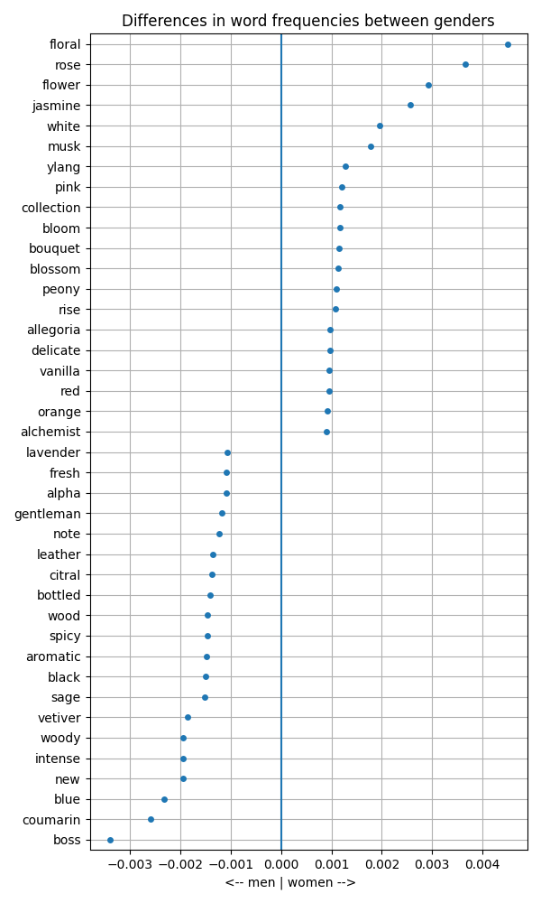

<figure style="text-align:center;">
  
  <figcaption><em>(Banner image) Image by author, created using AI</em></figcaption>
</figure>

# Boss vs. Bloom: Uncovering Gender Bias in Fragrance Descriptions with Python

*Using NLP and web scraping to analyse how fragrance retailers use different language and pricing for women's and men's products*

---

Perfume is not just about scent — it is also about language. And that language differs markedly depending on whether a fragrance is marketed to men or women.

I scraped ~700 fragrance listings from Sephora UK and used NLP to compare how women's and men's products are described. This article walks through the pipeline — scraping, lemmatisation, document-term matrices — and what came out of it. Along the way, we also take a quick look at whether women's fragrances are priced differently from men's.

All code is in Python (`requests`, `BeautifulSoup`, `spaCy`, `pandas`). The full project — code, scraped data, and document-term matrices — is available at [github.com/colinvn/perfumes-by-gender](https://github.com/colinvn/perfumes-by-gender).

---

## The Data: Scraping Sephora

The data comes from the fragrance section of [Sephora UK](https://www.sephora.co.uk/fragrances). The scraping process takes place in two stages, mirroring the two-level structure of the webshop: first a product listings page giving an overview of all items, then individual product details pages containing the description and price for each item.

<figure style="text-align:center;">
  
  <figcaption><em>Website by Sephora, screenshot by author</em></figcaption>
</figure>

The listings page URL encodes the gender filter directly, making it straightforward to collect women's and men's fragrances separately. We request each page with `requests`, parse the HTML with `BeautifulSoup`, and extract the product SKU and detail page URL from each product card:

```python
import requests
from bs4 import BeautifulSoup
import pandas as pd
import numpy as np

headers = {'User-Agent': 'my-app/0.1'}  # without headers, access is denied

url_product_list = {}
genders = ['women', 'men']

for gender in genders:
    url_base = 'https://www.sephora.co.uk/fragrances'
    url_filter = '?filter=fhlocation=c1:en-GB:categories%3Cc1:c1:c2:hisandhers%3E'
    url_gender = '2' if gender == 'women' else '1'
    url_end = ('!brand=a70!restricted=1&fhviewsize=600&siteid=79&sitearea=department'
               '&device=desktop&special-pagedepth=home&fhref=viewlister&fhref=facet=hisandhers')
    url_product_list[gender] = url_base + url_filter + url_gender + url_end

product_listings = {}
for gender in genders:
    response = requests.get(url_product_list[gender], headers=headers)
    soup = BeautifulSoup(response.text, 'html.parser')
    product_listings[gender] = soup.find_all('div', class_='Product')
    print(f'Collected {len(product_listings[gender])} items for {gender}.')

col_id, col_url, col_gender = [], [], []
for gender in genders:
    for product in product_listings[gender]:
        tag = product.select('a')[0]
        sku = tag['data-product-sku']   # stock-keeping unit — basically a product ID
        href = tag['href']
        col_id.append(sku)
        col_url.append('https://www.sephora.co.uk' + href)
        col_gender.append(gender)

df = pd.DataFrame({'id': col_id, 'url': col_url, 'gender': col_gender})
```

This gives us a crawl list of 703 products (500 women's, 203 men's). We then visit each product detail page to extract the marketing description and the per-millilitre price:

<figure style="text-align:center;">
  
  <figcaption><em>Website by Sephora, screenshot by author</em></figcaption>
</figure>

```python
def get_product_data(url):
    response = requests.get(url, headers=headers)
    soup = BeautifulSoup(response.text, 'html.parser')

    try:
        price_per_ml = float(
            soup.find('span', class_='price-per-ml info-price-per-ml')
            .text.strip()
            .split('(')[1].split('/')[0]
            .replace(',', '.')
        )
    except:
        price_per_ml = np.nan

    try:
        description = soup.find('section', id='information').text.strip().replace('\n', '. ')
    except:
        description = np.nan

    return {'price_per_ml': price_per_ml, 'description': description}

df['description'] = pd.NA
df['price_per_ml'] = pd.NA

for i in df.index:
    url = df.at[i, 'url']
    product_data = get_product_data(url)
    df.at[i, 'description'] = product_data['description']
    df.at[i, 'price_per_ml'] = product_data['price_per_ml']
```

After converting `price_per_ml` to a numeric type and checking for missing values — there are none — we have a clean dataset of **703 products** (491 women's, 201 men's), each with a text description and a price per millilitre.

---

## A Quick Look at Prices

Before turning to the text analysis, a brief detour: do women's fragrances cost more?

| | Count | Mean (£/ml) | Median (£/ml) | Std. dev. |
|--|--|--|--|--|
| Women | 491 | 2.13 | 1.92 | 1.33 |
| Men | 201 | 1.45 | 1.30 | 1.10 |

Women's fragrances are more expensive on average — £2.13/ml versus £1.45/ml — and the box plot shows the gap is consistent across the full distribution, not just driven by a few outliers:

<figure style="text-align:center;">
  
  <figcaption><em>Image by author</em></figcaption>
</figure>

The interquartile range for women (roughly £1.40–£2.40/ml) sits noticeably higher than for men (roughly £0.95–£1.56/ml). That said, the distributions substantially overlap and we do not conduct a formal test here. Whether this gap constitutes a "pink tax" or reflects differences in brand composition and product type is a question for another day — the main event is the text analysis.

---

## What Words Define Each Gender?

Do the marketing texts for women's and men's fragrances actually use different language? To answer this, we follow a standard NLP pipeline: deduplicate descriptions, lemmatise, build document-term matrices, and compare relative word frequencies.

### Preparing the Text

We filter out products without a description and remove duplicates — products sold in multiple sizes often share the same description, and we want to count each one only once:

```python
genders = ['women', 'men']

dict_descriptions = {}
for gender in genders:
    descriptions = (
        df[df['description'].apply(lambda x: isinstance(x, str))]
        .query(f'gender == "{gender}"')
        .description
        .drop_duplicates()
        .reset_index(drop=True)
    )
    dict_descriptions[gender] = descriptions
```

This leaves 499 unique women's descriptions and 202 unique men's descriptions.

### Lemmatisation with spaCy

Rather than counting raw word forms, we lemmatise — reducing each word to its base form so that "blooming", "bloomed", and "bloom" all count as the same token. We use spaCy's `en_core_web_sm` model and discard stop words and punctuation:

```python
import spacy

# On first run, download the model:
# !python -m spacy download en_core_web_sm

nlp = spacy.load('en_core_web_sm')

dict_lemmata = {}
for gender in genders:
    list_lemmata = []
    docs = nlp.pipe(dict_descriptions[gender])  # pipe returns a generator
    for doc in docs:
        lemmata = [
            token.lemma_.lower()
            for token in doc
            if not token.is_stop or token.is_punct
        ]
        list_lemmata.extend(lemmata)
    dict_lemmata[gender] = list_lemmata
```

The output is a flat list of lemmas for each gender — roughly 77,000 for women and 30,000 for men, reflecting both the larger sample and longer average descriptions in the women's category.

### Building Document-Term Matrices

We convert the lemmata into a document-term matrix (DTM) for each gender: a table where each row is a unique lemma and the columns record how often it appears in absolute and relative terms. We then merge the two DTMs and compute the **delta** — the difference in relative frequency between women's and men's descriptions. A positive delta means the word appears relatively more often in women's descriptions; a negative delta means it is overrepresented in men's.

```python
dfl_women = pd.DataFrame(dict_lemmata['women'], columns=['lemma'])
dtm_women = dfl_women['lemma'].value_counts().reset_index(name='absolute')
dtm_women['relative'] = dtm_women['absolute'] / dtm_women['absolute'].sum()

dfl_men = pd.DataFrame(dict_lemmata['men'], columns=['lemma'])
dtm_men = dfl_men['lemma'].value_counts().reset_index(name='absolute')
dtm_men['relative'] = dtm_men['absolute'] / dtm_men['absolute'].sum()

# Merge and compute delta (positive = more common in women's descriptions)
dtm = pd.merge(dtm_women, dtm_men, on='lemma', how='outer', suffixes=('_women', '_men')).fillna(0)
dtm['delta'] = dtm['relative_women'] - dtm['relative_men']
```

The merged DTM contains around 7,600 unique lemmas in total, most of which are rare or shared equally between both genders. The signal lies at the extremes.

### Filtering Out Noise

Before visualising, we remove terms that would dominate the results but carry no interesting gender signal:

- **Direct gender references** — "woman", "man", "feminine", "masculine" are trivially skewed and tell us nothing about marketing language
- **Fragrance-type terminology** — "parfum", "toilette", "eau" differ partly because Eau de Toilette is more common in men's lines, not because of deliberate word choices
- **Chemical compound names** — ingredient names like "benzyl", "butyl", "salicylate" appear at the bottom of every product page and don't reflect marketing copy
- **Brand-specific words** — excluded to avoid brand composition effects
- **Generic stop words** — particles such as "de" from French fragrance names

```python
words_genders = ['woman', 'man', 'homme', 'feminine', 'femininity', 'masculine']
words_terminology = ['perfume', 'parfum', 'toilette', 'fragrance', 'eau', 'aftershave', 'oil']
words_compounds = ['benzyl', 'butyl', 'alcohol', 'salicylate', 'ethylhexyl',
                   'methoxydibenzoylmethane', 'hydroxycitronellal', 'farnesol',
                   'methoxycinnamate', 'ionone']
words_brands = ['gucci', 'dolcegabbana']
words_stop = ['de']

more_exclusions = words_genders + words_terminology + words_compounds + words_brands + words_stop

counter = 20  # number of top words to show for each gender
dtm_mask = dtm[~dtm['lemma'].isin(more_exclusions)].sort_values('delta', ascending=False)
dtm_plot = pd.concat([dtm_mask[:counter], dtm_mask[-counter:]], ignore_index=True)
```

### The Result

```python
fig, ax = plt.subplots(figsize=(6, 10))
ax.scatter(dtm_plot['delta'], dtm_plot['lemma'])
ax.axvline(0, color='steelblue')
ax.set_xlabel('<-- men | women -->')
ax.set_title('Differences in word frequencies between genders')
plt.tight_layout()
plt.show()
```

<figure style="text-align:center;">
  
  <figcaption><em>Image by author</em></figcaption>
</figure>

---

## The Findings: Flowers, Pink, and Bosses

The dot plot is striking in its clarity.

**Women's fragrances** are described using a richly floral vocabulary: the top words are *floral*, *rose*, *flower*, *jasmine*, *bloom*, *blossom*, *bouquet*, *peony*, and *ylang* (as in ylang-ylang). The colour palette skews soft: *pink* and *white* feature prominently. Words like *delicate* and *vanilla* round out a picture of softness and sweetness.

**Men's fragrances** tell a different story. The most overrepresented words lean towards traditionally masculine connotations: *intense*, *woody*, *vetiver*, *spicy*, *aromatic*, *leather*, *sage*, *black*, *blue*. Descriptors like *gentleman* and *alpha* suggest a direct appeal to a certain idea of masculinity. And then there is *boss* — one of the most skewed words in the entire corpus.

The numbers make the gap concrete: *floral* makes up 0.58% of all words in women's descriptions but only 0.13% in men's — nearly five times as frequent. *Boss* shows the reverse: 0.37% in men's descriptions versus just 0.02% in women's, a more than tenfold difference.

The word "boss" deserves a note. It is partially explained by the fact that Hugo Boss has a higher share of its portfolio in the men's segment, so some of the signal is a brand composition effect. But even accounting for this, the word appears more in men's descriptions than brand distribution alone would predict.

Also notable is *coumarin*, a compound found in many aromatic and woody fragrances — its higher frequency in men's descriptions reflects genuinely different scent profiles rather than pure marketing language. The analysis picks up both real compositional differences and deliberate rhetorical choices; separating the two cleanly would require ingredient-level data beyond what is available here.

---

## Discussion

The findings confirm what many might intuitively suspect: women's and men's fragrances are marketed in systematically different ways, with language choices that reflect — and reinforce — traditional gender stereotypes.

What should we make of this? One interpretation is that the descriptions simply reflect genuine differences in scent profiles — women's fragrances really do use more floral ingredients. There is some truth to this. But the marketing language goes well beyond neutral scent description. Words like *delicate*, *pink*, *bouquet*, and *bloom* are rhetorical choices that evoke a particular femininity. Similarly, *intense*, *alpha*, and *gentleman* are not just scent descriptors — they are identity appeals. The language is doing work that has nothing to do with how a fragrance smells.

---

## Replicating This Analysis

The full code and data are at [github.com/colinvn/perfumes-by-gender](https://github.com/colinvn/perfumes-by-gender). The scraped dataset and document-term matrices are included as CSV files, so the text analysis can be reproduced without re-scraping the website. For a deeper methodological grounding in projects of this kind, John McLevey's [*Doing Computational Social Science*](https://methods.sagepub.com/book/mono/doing-computational-social-science/toc) (SAGE, 2022) is an excellent reference.

---

## About the author

<div style="display:flex;align-items:flex-start;gap:16px;">
  <div>
    <p>Bernd is a postdoctoral researcher at the University of Brot. His research is at the intersection of economics and philosophy, including questions of justice in market environments.</p>
  </div>
  
</div>
